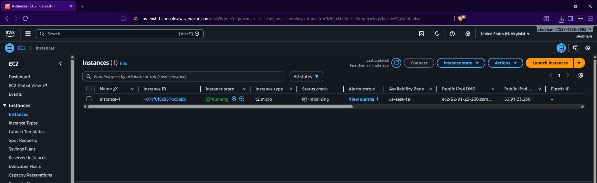
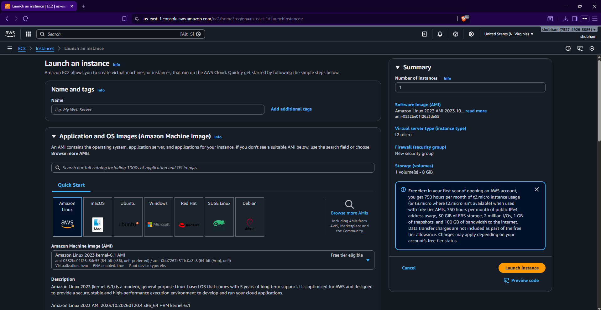
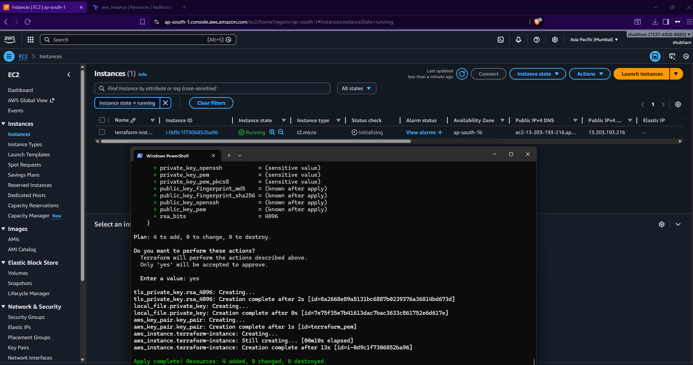

# AWS EC2 Deployment – Manual & Terraform

## Objective
Learn AWS core concepts and Terraform by launching an EC2 instance manually and via Infrastructure as Code.

---

## AWS Core Concepts
- EC2: Virtual server
- IAM: Access management
- VPC: Networking layer
- Security Groups: Firewall rules
- Key Pair: Secure SSH access

---

## Manual EC2 Deployment
Steps followed:
1. Logged into AWS Console
2. Navigated to EC2 → Launch Instance
3. Selected Amazon Linux 2
4. Used t2.micro instance
5. Configured security group for SSH
6. Connected via SSH



---

## Terraform EC2 Deployment

### Tools Used
- Terraform
- AWS CLI

### Steps
```bash
terraform init
terraform plan
terraform apply
```


